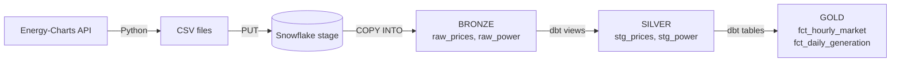
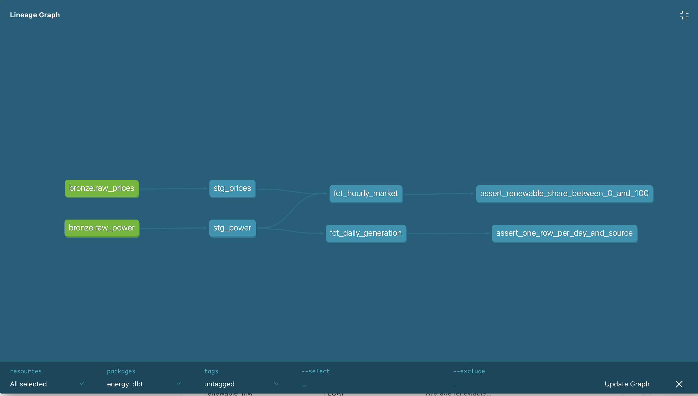

# ⚡ German Electricity Market — Snowflake + dbt

An end-to-end ELT project on German electricity data: raw data from the
[Energy-Charts API](https://api.energy-charts.info/) is loaded into **Snowflake**
and transformed with **dbt Core** following a **Bronze → Silver → Gold** architecture,
with automated data quality tests and generated documentation.

> This README documents the full procedure **and the problems I ran into**, so the project can be reproduced step by step.

🔗 **Related project:** [germany-energy-data-pipeline](https://github.com/TatianaTchouakam/germany-energy-data-pipeline)
processes the same Energy-Charts data on **Google Cloud with Terraform**. This repository tackles the same use case
with a **Snowflake + dbt** stack, to compare two modern data platforms on a single business problem.

---

## 📑 Table of contents

1. [Key insight](#-key-insight)
2. [Architecture](#️-architecture)
3. [Where to find what](#️-where-to-find-what)
4. [Step-by-step procedure](#-step-by-step-procedure)
5. [Data model](#-data-model)
6. [Data quality tests](#-data-quality-tests)
7. [Design decisions](#-design-decisions)
8. [Problems encountered and solutions](#-problems-encountered-and-solutions)
9. [Useful commands](#-useful-commands)
10. [Documentation and references](#-documentation-and-references)
11. [Next steps](#-next-steps)

---

## 🔍 Key insight

Over Q1 2025, the hourly renewable share of German generation shows a **strong negative
correlation with the day-ahead price (r = −0.77)**, consistent with the merit-order effect:
renewables have near-zero marginal cost and push expensive fossil plants out of the market.

| Metric | Value |
|---|---|
| Correlation renewable share ↔ price | **−0.77** |
| Hours with negative prices | **44** |
| Average day-ahead price | **111.9 EUR/MWh** |

*Correlation is not causation: gas prices, demand and cross-border flows also drive prices.*
Query: [`snowflake/04_exploration.sql`](snowflake/04_exploration.sql) (query 3).

---

## 🏗️ Architecture



| Layer | Content | Materialization |
|---|---|---|
| **Bronze** | Raw API data + lineage columns (`_source_file`, `_loaded_at`) | Tables (COPY INTO) |
| **Silver** | Typed timestamps, deduplication, classification of the 21 power series | dbt views |
| **Gold** | Business-ready facts: hourly market and daily generation | dbt tables |

### dbt lineage graph



---

## 🗂️ Where to find what

| What | File | Purpose |
|---|---|---|
| Extract | [`scripts/download_data.py`](scripts/download_data.py) | Calls the Energy-Charts API, writes `data/prices.csv` and `data/power.csv` |
| Load | [`scripts/load_to_bronze.py`](scripts/load_to_bronze.py) | Uploads the CSV files to the Snowflake stage (`PUT`) |
| Snowflake setup | [`snowflake/01_setup.sql`](snowflake/01_setup.sql) | Warehouse, database and Bronze/Silver/Gold schemas |
| Bronze loading | [`snowflake/02_bronze.sql`](snowflake/02_bronze.sql) | File format, stage, raw tables, `COPY INTO` |
| Security | [`snowflake/03_auth.sql`](snowflake/03_auth.sql) | `TRANSFORMER` role and `DBT_USER` service user |
| Exploration | [`snowflake/04_exploration.sql`](snowflake/04_exploration.sql) | Profiling queries and key insight |
| dbt config | [`energy_dbt/dbt_project.yml`](energy_dbt/dbt_project.yml) | Silver = views, Gold = tables |
| dbt connection | [`energy_dbt/profiles.yml`](energy_dbt/profiles.yml) | Reads credentials from environment variables |
| Sources | [`energy_dbt/models/sources.yml`](energy_dbt/models/sources.yml) | Declares the Bronze tables |
| Silver models | [`energy_dbt/models/silver/`](energy_dbt/models/silver/) | `stg_prices.sql`, `stg_power.sql`, `_silver.yml` |
| Gold models | [`energy_dbt/models/gold/`](energy_dbt/models/gold/) | `fct_hourly_market.sql`, `fct_daily_generation.sql`, `_gold.yml` |
| Custom tests | [`energy_dbt/tests/`](energy_dbt/tests/) | Singular data tests |
| Macro | [`energy_dbt/macros/generate_schema_name.sql`](energy_dbt/macros/generate_schema_name.sql) | Keeps schema names `SILVER` / `GOLD` |
| Config template | [`.env.example`](.env.example) | Variables to fill in `.env` |

```
energy-dbt-snowflake/
├── scripts/
│   ├── download_data.py
│   └── load_to_bronze.py
├── snowflake/
│   ├── 01_setup.sql
│   ├── 02_bronze.sql
│   ├── 03_auth.sql
│   └── 04_exploration.sql
├── energy_dbt/
│   ├── dbt_project.yml
│   ├── profiles.yml
│   ├── macros/generate_schema_name.sql
│   ├── models/
│   │   ├── sources.yml
│   │   ├── silver/  (stg_prices, stg_power, _silver.yml)
│   │   └── gold/    (fct_hourly_market, fct_daily_generation, _gold.yml)
│   └── tests/       (2 singular tests)
├── docs/lineage.png
├── requirements.txt
├── .env.example
└── README.md
```

---

## 🚀 Step-by-step procedure

### Prerequisites

- A Snowflake account (the 30-day free trial is enough — AWS, region Europe Central / Frankfurt)
- Python 3.11 with conda, Git, and OpenSSL (pre-installed on macOS)

### 1. Python environment

```bash
conda create -n energy-dbt python=3.11 -y
conda activate energy-dbt
pip install -r requirements.txt
```

### 2. Snowflake setup

In a Snowsight SQL worksheet, run [`snowflake/01_setup.sql`](snowflake/01_setup.sql) (**Run All**).
It creates an X-Small warehouse with 60-second auto-suspend to save credits, the `ENERGY` database
and the `BRONZE`, `SILVER` and `GOLD` schemas.

### 3. Extract the data

```bash
python scripts/download_data.py
```

Expected output: `2159 prices, 181356 power rows` for 2025-01-01 → 2025-03-31.

### 4. Create the Bronze objects

Run part 1 of [`snowflake/02_bronze.sql`](snowflake/02_bronze.sql): CSV file format,
internal stage `RAW_STAGE`, and the two raw tables.

### 5. Key-pair authentication and service user

Generate a key pair (stored outside the project, never committed):

```bash
mkdir -p ~/.snowflake
openssl genrsa 2048 | openssl pkcs8 -topk8 -inform PEM -out ~/.snowflake/rsa_key.p8 -nocrypt
openssl rsa -in ~/.snowflake/rsa_key.p8 -pubout -out ~/.snowflake/rsa_key.pub
chmod 600 ~/.snowflake/rsa_key.p8
grep -v "PUBLIC KEY" ~/.snowflake/rsa_key.pub | tr -d '\n'   # copy this public key
```

Paste the public key into [`snowflake/03_auth.sql`](snowflake/03_auth.sql) and run it.
Then create your `.env` from the template:

```bash
cp .env.example .env    # fill in account, DBT_USER and key path
```

### 6. Load into Bronze

```bash
python scripts/load_to_bronze.py
```

Then run part 2 of [`snowflake/02_bronze.sql`](snowflake/02_bronze.sql) (`COPY INTO`).
The final check must return **2,159** rows for prices and **181,356** for power.

### 7. Run dbt

```bash
cd energy_dbt
set -a; source ../.env; set +a   # load environment variables (dbt does not read .env itself)
dbt debug                         # must end with "All checks passed!"
dbt build                         # 4 models + 14 tests
```

### 8. Documentation

```bash
dbt docs generate
dbt docs serve                    # opens http://localhost:8080 — stop with Ctrl + C
```

---

## 🧱 Data model

### Silver

| Model | Grain | Description |
|---|---|---|
| `stg_prices` | 1 row per hour | Day-ahead price (DE-LU), UTC timestamp, deduplicated |
| `stg_power` | 1 row per quarter-hour and series | 21 series classified by `series_type`, `source_group`, `unit`, `is_renewable` |

Classification of the 21 Energy-Charts series:

| `series_type` | Series | Unit |
|---|---|---|
| `generation` (15) | Solar, Wind onshore/offshore, Biomass, Hydro, Geothermal, Fossil (lignite, hard coal, gas, oil, coal-derived gas), Pumped storage, Waste, Others | MW |
| `balance` (2) | Cross border electricity trading, Hydro pumped storage consumption | MW |
| `load` (2) | Load, Residual load | MW |
| `share` (2) | Renewable share of generation, Renewable share of load | % |

### Gold

| Model | Grain | Business question |
|---|---|---|
| `fct_hourly_market` | 1 row per hour (2,159) | Does the price fall when renewables produce a lot? |
| `fct_daily_generation` | 1 row per day and source group (540 = 90 × 6) | How much energy does each source group produce per day? |

---

## ✅ Data quality tests

`dbt build` runs **14 tests** and builds Gold only if Silver tests pass.

| Test | Model | Checks |
|---|---|---|
| `not_null`, `unique` | `stg_prices.price_ts_utc` | One price per hour |
| `not_null` | `stg_prices.price_eur_mwh`, `stg_power.power_ts_utc` | No missing values |
| `accepted_values` | `stg_power.series_type`, `source_group`, `unit` | Classification stays valid if the API changes |
| `not_null`, `unique` | `fct_hourly_market.hour_utc` | One row per hour after the join |
| `not_null` | `fct_daily_generation` columns | Complete daily facts |
| `assert_renewable_share_between_0_and_100` | `fct_hourly_market` | A share is always between 0 and 100 % |
| `assert_one_row_per_day_and_source` | `fct_daily_generation` | No duplicate aggregates |

---

## 🧠 Design decisions

- **Two granularities:** prices are hourly, generation is quarter-hourly. Generation is averaged per hour before the join.
- **Mixed units in the source:** the API mixes generation (MW), load, cross-border balance and percentages. Silver classifies each series so Gold never sums MW with %.
- **Time zones:** timestamps are stored in UTC; daily aggregates use Europe/Berlin local days.
- **Idempotent models:** `QUALIFY ROW_NUMBER()` removes duplicates if data is reloaded.
- **Lineage columns in Bronze:** `_source_file` and `_loaded_at` trace every raw row.
- **Security:** dedicated `DBT_USER` service user, key-pair authentication, least-privilege `TRANSFORMER` role. No secrets in the repository.
- **Silver as views, Gold as tables:** Silver is always up to date at no storage cost; Gold is fast for dashboards.

---

## 🐞 Problems encountered and solutions

| # | Problem / error message | Cause | Solution |
|---|---|---|---|
| 1 | `Warehouse 'COMPUTE_WH' does not exist or not authorized` | New trial accounts do not always include a default warehouse | Created a dedicated `ENERGY_WH` (X-Small, auto-suspend 60 s) in `01_setup.sql` |
| 2 | `No active warehouse selected in the current session` | Each new Snowsight worksheet starts without a warehouse | Added `USE WAREHOUSE ENERGY_WH;` at the top of every worksheet |
| 3 | File upload to the stage via the Snowsight UI did not open | UI navigation issue | Switched to a Python script with `PUT` — more reproducible and versioned in Git |
| 4 | `PUT` fails on the local path | The project folder name contains a space | Wrapped the path in quotes: `PUT 'file://...'` |
| 5 | `404 Not Found: post <placeholder>.snowflakecomputing.com` | `.env` still contained placeholder values / was not saved | Filled in the real account identifier (`ORG-ACCOUNT`) and saved the file |
| 6 | `JWT token is invalid` | The personal user name was lowercase; the connector sends it in uppercase in the JWT | Created an uppercase `DBT_USER` service user with its own role — also better practice |
| 7 | dbt would create schemas like `SILVER_GOLD` | dbt default behaviour concatenates target and custom schema | Overrode the `generate_schema_name` macro |
| 8 | dbt cannot find `SNOWFLAKE_ACCOUNT` | dbt does not read `.env` files automatically | `set -a; source ../.env; set +a` before running dbt |
| 9 | Warning `unused configuration paths: models.energy_dbt.gold` | Gold folder configured but still empty | Disappears once a Gold model exists |
| 10 | Risk of wrong aggregates | The power endpoint mixes MW, % and consumption series | Profiled the 21 series first, then classified them in `stg_power` |
| 11 | 8,636 quarter-hours per series instead of 8,640 | DST switch on 30 March 2025 (API dates in German local time) | Documented; timestamps kept in UTC |
| 12 | dbt compilation error risk | YAML descriptions accidentally pasted into a `.sql` model | Descriptions belong only in `_silver.yml` / `_gold.yml` |
| 13 | Lineage graph showed only part of the pipeline | The `--select` filter was set to one model | Cleared `--select` and clicked *Update Graph* |
| 14 | `KeyboardInterrupt` traceback after `dbt docs serve` | Normal output when stopping the server with Ctrl + C | Not an error |

**Lessons learned:** profile the raw data before transforming it, keep secrets out of code from the first minute,
and prefer scripted, versioned steps over manual UI actions.

---

## 🧰 Useful commands

| Command | What it does |
|---|---|
| `conda activate energy-dbt` | Activate the project environment |
| `set -a; source ../.env; set +a` | Load credentials for dbt (from `energy_dbt/`) |
| `dbt debug` | Test the Snowflake connection |
| `dbt run` | Build all models |
| `dbt run --select stg_power` | Build a single model |
| `dbt test` | Run all data tests |
| `dbt build` | Run models and tests in lineage order |
| `dbt docs generate && dbt docs serve` | Generate and open the documentation |

---

## 📚 Documentation and references

- Energy-Charts API: https://api.energy-charts.info/
- dbt documentation: https://docs.getdbt.com/
- dbt Snowflake setup: https://docs.getdbt.com/docs/core/connect-data-platform/snowflake-setup
- dbt custom schemas: https://docs.getdbt.com/docs/build/custom-schemas
- dbt data tests: https://docs.getdbt.com/docs/build/data-tests
- Snowflake key-pair authentication: https://docs.snowflake.com/en/user-guide/key-pair-auth
- Snowflake `PUT`: https://docs.snowflake.com/en/sql-reference/sql/put
- Snowflake `COPY INTO`: https://docs.snowflake.com/en/sql-reference/sql/copy-into-table

---

## 🔭 Next steps

- Load files from **Azure Blob Storage** through an external stage
- **Incremental** dbt models for daily refreshes
- Orchestration with **Airflow** and CI with **GitHub Actions** (`dbt build` on every pull request)
- A small dashboard on top of the Gold tables

---

## 👩‍💻 Author

**Tatiana Tchouakam Chouacheu** — Data Engineer
[LinkedIn](https://www.linkedin.com/in/tatiana-tchouakam-chouacheu-91152935b) ·
[GitHub](https://github.com/TatianaTchouakam) ·
[YouTube](https://www.youtube.com/@TatianaBuildsData)

